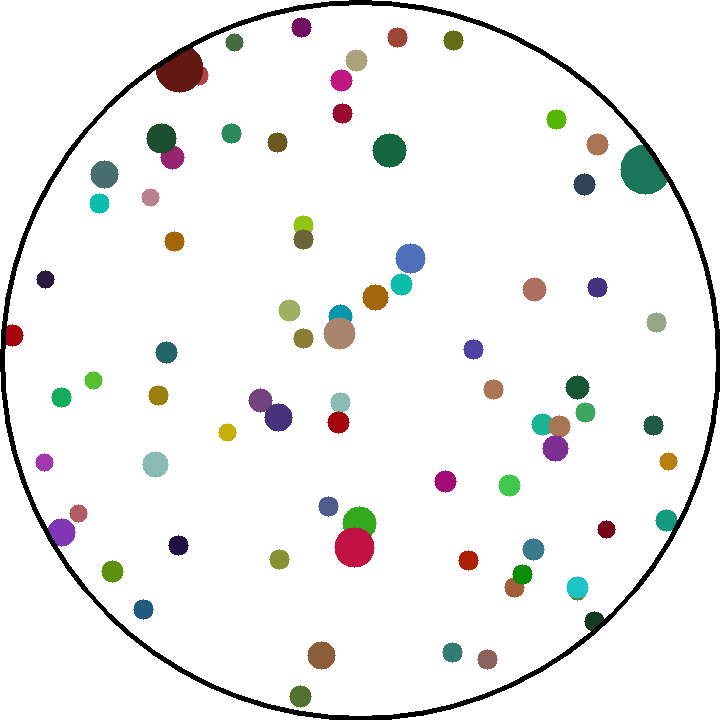
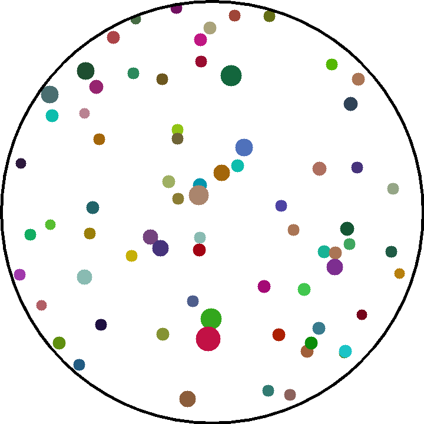
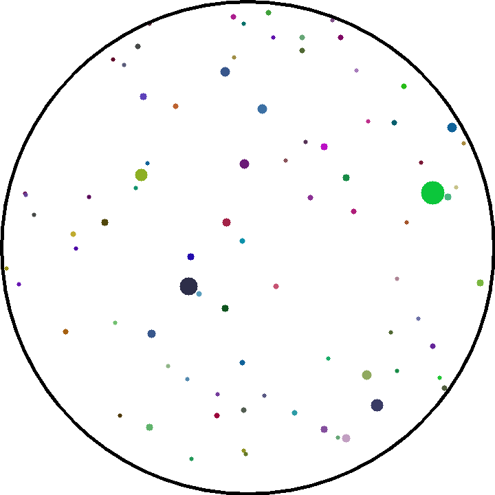
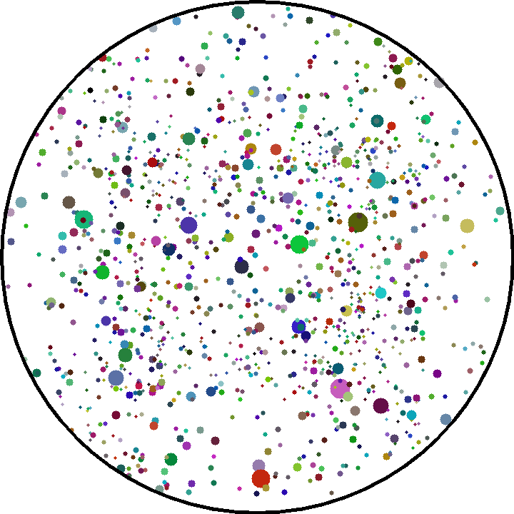
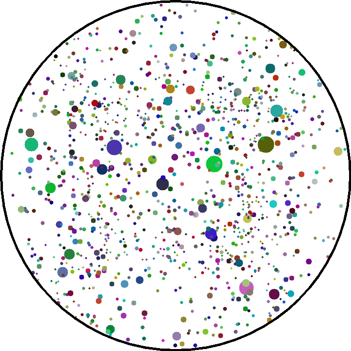

# CAMERANIM

Cameranim is a small renderrer aiming to show how is it like to move in a pointcloud for a camera. This tool help to generate gif images and two types of camera are supported: perspective and equidistant.

# Example

## Perspective camera (60º FOV)

For a translation colinear with optical axis, it is hard to see a lot of change. Hints are faint, it is not easy to estimate the quantity of movement precisely.

It is a much better with a translation orthogonal to the optical axis, the quantity of movement is clearer.

But, when it comes to a rotation, it is hard to distinguish it with the previous translation.

## Equidistant camera (210º)
Here, the side of the image give a better perception of the translation colinear with the optical axis.

The rotation and the translation have two very different look.

